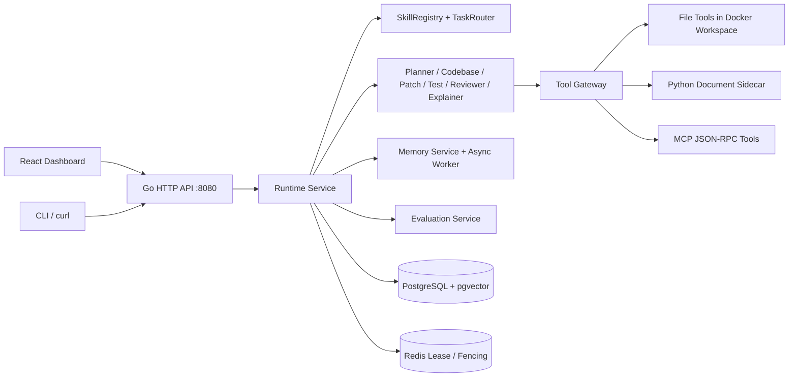

# CodeCoDriver 当前架构设计

本文描述当前实际代码中的架构，而不是初始规划中的理想架构。

## 1. 总体架构

CodeCoDriver 当前是一个 Go 单体服务，内部按包分层，而不是微服务。Web Dashboard、CLI/curl 都走同一个 HTTP API，API 调用 Runtime，Runtime 负责任务调度、Agent 编排、工具执行、记忆沉淀和评测。

入口在 `cmd/api/main.go`，HTTP 路由在 `internal/server/http.go`，核心 Runtime 在 `internal/runtime/service.go`。

## 2. Runtime 与 Agent Loop

任务创建后先由 TaskRouter 选择 Skill，再进入执行循环。默认代码任务路径是：

1. Planner 生成计划，并检查历史成功记忆和当前文件树，判断任务是否已经完成。
2. Codebase Agent 根据计划召回相关文件、symbol、测试文件和长期记忆，生成 context pack。
3. Patch Agent 在每任务独立的 Docker workspace 里真实读取、编辑文件，再由 `git diff` 生成 patch。
4. Test Agent 在同一个 Docker workspace 内执行真实测试，返回结构化测试报告。
5. Reviewer 检查正确性、证据、回归风险，输出 APPROVE、REQUEST_CHANGES 或 HUMAN_REVIEW_REQUIRED。
6. 测试失败或 Reviewer 要求修改时进入有界 repair loop，每次从 workspace 的 Git baseline 重置后重试，最多若干次，不会无限重试。
7. 完成或人工审核后，把执行摘要、成功模式、失败模式写入长期记忆。

Explainer 是独立只读路径，只运行 Planner、Codebase、Explainer，不生成 patch，输出 Markdown explanation artifact。相关实现见 `internal/runtime/agents.go` 和 `internal/runtime/explain_agent.go`。

## 2.1 动态 Workflow

Runtime 不再把 `Planner -> Codebase -> Patch -> Test -> Reviewer` 写死在 `Service.executeTask` 里，而是把执行路径声明为 `WorkflowSpec`，由 `internal/runtime/workflow.go` 统一解释。当前内置四种 workflow：

| Workflow | 路径 |
|---|---|
| `standard_agent_loop` | Codebase -> Patch Loop -> Finish |
| `documentation_agent_loop` | 与标准路径一致，但通过 documentation skill 注入更严格的只改文档约束 |
| `explanation_agent_loop` | Codebase -> Explainer -> Finish |
| `dynamic_agent_loop` | Orchestrator 决策 -> Codebase -> Explainer / Patch Loop / Human Review |

`dynamic_agent_loop` 是当前默认 Skill 之外的可选 workflow，Dashboard 中可显式选择 `dynamic-agent` skill。Orchestrator 根据 Planner 输出、任务描述、历史记忆和 Human Feedback 输出 JSON 决策，支持 `code_change`、`explain`、`request_human` 三种路由；JSON 不可解析或未配置 LLM 时回退到代码修改路径，避免阻塞任务。

Workflow 节点支持 `agent`、`decision`、`patch_loop`、`finish` 四种类型，patch 重试次数来自 workflow spec，不再只能使用全局常量。Patch Loop 内部仍保留原有的 sandbox 验证、Reviewer 决策、有界 repair 和 replan 逻辑，因此动态路由不会绕过真实测试证据。

## 3. Worker 与可靠性

Runtime 支持两种 worker 模式：

| 模式 | 机制 |
|---|---|
| 单进程模式 | 进程内 channel 队列，`CODECODRIVER_WORKERS` 控制并发 |
| 分布式模式 | 配置 Redis 后，多个 worker 从 PostgreSQL 领取任务，Redis lease 防止重复执行 |

分布式执行的关键点是 fencing token：每个 worker 领取任务时拿到递增 token，状态更新时校验 token，防止旧 worker 覆盖新 worker 的结果。启动恢复采用 at-least-once，中断的 Run 会标记失败，然后从新 Run 重新执行。

相关设计见 `docs/05-runtime-reliability.md`。

## 4. 记忆体系

记忆不是聊天记录，而是结构化的任务和仓库经验。`MemoryEntry` 包含 title、summary、symptom、root_cause、changed_files、symbols、test_command、verification_evidence、success_score 等字段。

记忆生命周期分三层：

- 写入：任务结束后沉淀 execution_summary、execution_success、failure_pattern。
- 检索：关键词、pgvector cosine、新鲜度、访问频率混合召回，只把精简后的 memory guidance 注入 Agent。
- 提炼：异步 memory worker 调用 DeepSeek 批量提炼，做相似去重和成功/失败冲突合并，生成 refined/resolved_pattern 记忆。

embedding 默认走火山方舟 Doubao，2560 维写入 pgvector halfvec + HNSW；没有 API Key 时回退到确定性本地 embedding。

实现主要在 `internal/memory` 和 `internal/store/memory.go`。

## 5. 工具与沙箱

Tool Gateway 是统一的工具入口，Agent 只通过 Gateway 调工具，不直接依赖具体实现。当前支持：

- Workspace 文件工具：read_file、search_files、read_symbols、edit_file、write_file、generate_patch。
- Python sidecar：文档解析和文本分块，通过 HTTP 接入。
- MCP：JSON-RPC stdio 协议，支持工具能力协商。

当前实现不再有两层复制：每个任务创建一个 Docker named volume，宿主仓库通过 tar 导入容器内的 `/workspace`，然后 `read_file`、`search_files`、`read_symbols`、`edit_file`、`write_file`、`generate_patch` 和测试全部在该 workspace 内执行。宿主仓库不会 bind mount，文件工具也拒绝路径穿越、绝对路径和 `.git` 文件。

Docker 容器默认无网络、非 root、只读根文件系统，并限制内存、CPU 和 PIDs；`/tmp` 使用 tmpfs 保存 Go cache 和编译产物。`search_files` 和 `read_symbols` 在容器内调用 `ripgrep`，`generate_patch` 通过容器内 `git diff` 生成真实 patch。任务结束时删除容器并清理 volume。

详细设计见 `docs/12-docker-sandbox.md`。

## 6. 存储与可观测性

PostgreSQL 通过 `internal/store/postgres.go` 持久化 Repository、Task、Run、Step、Artifact、Memory、ToolCall、LLMUsage、HumanReview、Evaluation 等数据，11 个 migration 从基础表逐步扩展到 embedding、记忆提炼、Skill 和真实通过判定。

每次执行都会记录：

- Run/Step 执行状态。
- LLM prompt/completion token、耗时、估算成本。
- 工具调用请求、响应、错误、耗时。
- 计划、context、patch、test report、review 等 artifact。

Dashboard 的 Task Trace 页面就是读这套 trace 数据，Evaluation 页面则是基于同一套数据做批量统计和质量评分。评测的四层维度是 result_usability、planning、efficiency、safety。

详细设计见 `docs/08-evaluation-design.md`。

## 7. 一句话总结

CodeCoDriver 是一个“Go 单体 Runtime + PostgreSQL 状态/记忆 + Redis 分布式协调 + React 控制台 + 可插拔工具/技能/模型”的软件工程 Agent 系统，核心价值不是单次对话能力，而是任务执行、真实验证、长期记忆和可观测评测的闭环。
