# CodeCoDriver Docker Workspace

本文记录当前 Docker workspace 的实现、隔离边界、配置方式和验证方式。该文件继续保留 `docker-sandbox.md` 的名字，但实现已经从“补丁验证沙箱”演进为“所有文件工具共用的任务工作区”。

## 1. 目标

每个任务创建一份隔离仓库副本，并把 Agent 的读取、检索、编辑、patch 生成和测试全部放进同一份副本。实现目标是：

1. 宿主原始仓库始终只读，不会被 Agent 工具或测试命令修改。
2. Agent 主进程仍在宿主或 API 容器中，但所有文件相关操作必须走 Docker workspace，不再直接读宿主路径。
3. 容器默认无网络、非 root、只读根文件系统，并限制资源，降低恶意或错误代码造成的风险。
4. Patch 不再由模型手写 unified diff，而是在 workspace 内真实编辑文件后由 `git diff` 生成；Test Agent 在同一 workspace 运行测试。
5. 失败时保留可审计的 tool call、patch proposal 和 sandbox report，供 Review Agent 和评测系统使用。

## 2. 实现位置

| 模块 | 作用 |
|---|---|
| `internal/sandbox/workspace.go` | `Workspace` 接口：所有文件工具和测试的统一契约 |
| `internal/sandbox/docker_workspace.go` | Docker workspace 实现：导入仓库、创建 volume、文件工具、`rg` 检索、`git diff`、测试、清理 |
| `internal/sandbox/runner.go` | 配置默认值、diff 解析/preflight/修复辅助函数 |
| `internal/sandbox/docker_test.go` | Docker 集成测试，默认跳过，由 `CODECODRIVER_RUN_DOCKER_TESTS=1` 开启 |
| `cmd/sandbox-smoke/main.go` | 独立冒烟工具，验证 Docker workspace 可跑通且不修改原仓库 |
| `docker/Dockerfile.sandbox` | 沙箱镜像：Go 1.24 Alpine + git + ripgrep + python3 + ca-certificates |
| `docker/Dockerfile.api` | API 镜像：构建 Go 服务，运行时包含 docker CLI |
| `compose.yaml` | 本地一键启动 PostgreSQL、Redis、沙箱镜像和 API |

`cmd/api/main.go` 通过 `engine.SetWorkspaceFactory(sandbox.NewWorkspaceFromEnv)` 注入 workspace factory。`NewWorkspaceFromEnv` 始终创建 Docker workspace，不再有本地驱动作为生产路径。

## 3. 执行流程

```mermaid
flowchart LR
  Task[Task created] --> Create[Create per-task Docker volume]
  Create --> Import[Host repo tar -> /workspace]
  Import --> Baseline[git init + baseline commit]
  Baseline --> Read[read_file / search_files / read_symbols]
  Read --> Edit[edit_file / write_file]
  Edit --> Patch[generate_patch via git diff]
  Patch --> Test[Test Agent runs command in same workspace]
  Test --> Report[Structured Report]
```



具体步骤：

1. `NewDockerWorkspace` 创建 `codecodriver-workspace-*` named volume，不 bind mount 宿主路径。
2. `writeRepositoryTar` 跳过 `.git`、`.cache`、`node_modules` 和符号链接，限制仓库大小。
3. 容器内以 `nobody` 解包到 `/workspace`，执行 `git init` 并提交 baseline。
4. `read_file` 在容器内用 Python 读取；`search_files` 和 `read_symbols` 在容器内调用 `rg`，Python 只负责解析结果。
5. `edit_file`/`write_file` 修改 workspace 文件；`generate_patch` 执行 `git add -A && git diff --cached --binary` 得到真实 patch。
6. `RunTest` 默认执行 `go test ./...`，或使用仓库注册的 `test_command`；documentation-only 任务可跳过测试但必须保证修改已生成 patch。
7. 任务结束或 patch loop 进入下一次尝试时，调用 `Reset` 回到 baseline，最后 `Close` 删除 volume。

## 4. 隔离边界

容器使用以下默认限制：

| 配置 | 默认值 | 说明 |
|---|---|---|
| 内存 | `2g` | 防止命令耗尽宿主机内存 |
| CPU | `2` | 限制编译和测试的 CPU 占用 |
| PIDs | `256` | 限制进程数量，降低 fork bomb 风险 |
| 文件系统 | `--read-only` | 根文件系统只读 |
| 可写临时目录 | `/tmp` tmpfs | 用于 Go cache、GOPATH 和编译产物 |
| 网络 | `none` | 默认无网络；需要下载模块时配置代理网络 |
| 用户 | `nobody` | 非 root 执行 |
| Capabilities | `--cap-drop ALL` | 不保留 Linux capabilities |
| 特权升级 | `--security-opt no-new-privileges` | 禁止 setuid 等提权 |
| Docker socket | 不注入容器 | workspace 内无法访问 Docker daemon |

路径安全由两层保证：`workspaceRelativePath` 拒绝绝对路径、`..`、Windows 盘符和 `.git` 路径；导入 tar 时跳过符号链接，避免容器内通过链接访问额外文件。

## 5. 网络与依赖

默认 `CODECODRIVER_SANDBOX_NETWORK=none`。真实 Go 仓库编译时通常需要下载模块，因此可通过环境变量接入有外网权限的网络，并在容器内设置 `GOPROXY`：

| 环境变量 | 说明 |
|---|---|
| `CODECODRIVER_SANDBOX_IMAGE` | 沙箱镜像，默认 `codecodriver-sandbox:local` |
| `CODECODRIVER_SANDBOX_DOCKER_BIN` | docker CLI 路径，默认 `docker` |
| `CODECODRIVER_SANDBOX_NETWORK` | Docker network；默认 `none` |
| `CODECODRIVER_SANDBOX_GOPROXY` | 容器内 Go module proxy，默认 `https://goproxy.cn,direct` |
| `CODECODRIVER_SANDBOX_MEMORY` | 内存限制，默认 `2g` |
| `CODECODRIVER_SANDBOX_CPUS` | CPU 限制，默认 `2` |
| `CODECODRIVER_SANDBOX_PIDS_LIMIT` | PIDs 限制，默认 `256` |
| `CODECODRIVER_SANDBOX_TIMEOUT_SECONDS` | 单次验证超时 |

`compose.yaml` 中 API 容器挂载 Docker socket 来创建 workspace 容器，这是宿主机级的信任边界。workspace 容器本身不会挂载 Docker socket。

## 6. CRLF 与 patch 稳定性

Windows 仓库常见的 CRLF 行尾曾导致 patch 应用报 trailing whitespace。当前处理链：

1. `ReadFile` 和编辑脚本读取原文件后先归一化为 LF 操作，写回时保留原文件行尾。
2. `generate_patch` 从容器内 Git baseline 生成 patch。
3. 编辑工具是幂等的：相同 `edit_file`/`write_file` 请求第二次返回 `changed=false`。
4. Patch Loop 对完全相同的工具调用注入错误反馈，要求模型重新读取文件，而不是反复调用同一编辑。
5. 内容区间替换会检查目标区间是否已经等于期望内容，避免插入重复行。

## 7. 为什么用 `rg`/`grep` 而不是 Go 自己遍历

`search_files` 和 `read_symbols` 的检索动作发生在 Docker workspace 内部，具体使用 `ripgrep`（`rg`）而不是 Go 遍历整个仓库。原因：

- `rg` 原生并行、尊重 `.gitignore`、内存占用低，适合在大仓库中快速定位符号和关键词。
- 检索结果必须来自容器内的 `/workspace`，不能从宿主任意路径读取，否则会破坏“宿主只读”边界。
- Python 只负责把 `rg` 的 stdout 转成结构化 JSON，不承担扫描逻辑，减少跨语言错误。
- 其他主流 coding agent（Claude Code、Codex、OpenHands、Aider 等）通常也使用 workspace-local 的 ripgrep/grep 做快速文本搜索，再用 AST/embedding 索引补充符号和语义召回；本项目当前用 `rg` 覆盖关键词/符号，由索引器提供文件和符号索引，记忆层提供语义召回。

## 8. 实测结果

本地验证：

```text
go test ./...
go run ./cmd/sandbox-smoke
CODECODRIVER_RUN_DOCKER_TESTS=1 go test ./internal/sandbox -run TestDocker -v -count=1
```

Docker 集成测试覆盖：

- `TestDockerWorkspaceFileTools`：read/search/symbols/edit/write/patch/test/reset/close 全链路。
- `TestDockerWorkspaceEditPreservesCRLF`：CRLF 文件编辑后仍保留行尾。
- `TestWorkspaceRelativePathRejectsEscapes`：拒绝路径穿越和 `.git` 路径。

## 9. 已知边界

- 当前 Docker workspace 是“所有文件工具 + 测试”隔离，不是 Agent 主进程的完整权限隔离。
- API 容器必须访问 Docker socket 才能创建 workspace，因此 Docker socket 权限等同于宿主机管理员权限。
- 允许联网后，测试命令可以访问外部网络；对真正不可信代码需要进一步限制 DNS、出网白名单和依赖供应链。
- Windows 与 Linux 的路径、行尾差异仍需要在新增 demo 仓库时单独验证。
